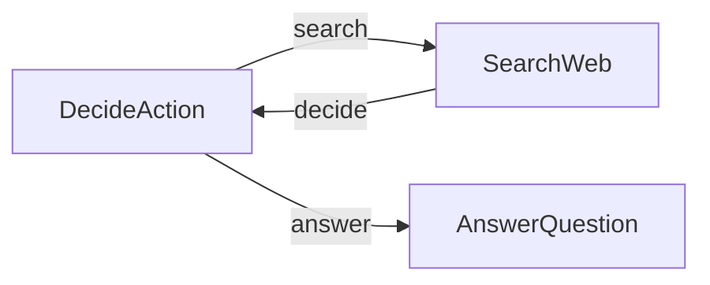

# PocoFlow Agent

A research agent that searches the web and uses YAML-structured LLM decisions.

## What It Shows

- **3-node agent loop**: decide -> search -> decide -> answer
- **YAML structured output**: LLM returns action decisions in YAML
- **Web search**: DuckDuckGo search integration
- **Retry**: DecideAction retries on YAML parse failures
- **Multi-provider**: works with any supported LLM provider

## Run It

```bash
pip install -r requirements.txt

# Anthropic (default)
export ANTHROPIC_API_KEY="your-key"
python main.py "What is quantum computing?"

# Ollama (local)
python main.py --provider ollama --model llama3.2 "What is quantum computing?"

# See all options
python main.py --help
```

## How It Works



- **DecideAction** — LLM decides whether to search or answer
- **SearchWeb** — searches DuckDuckGo, appends results to context
- **AnswerQuestion** — generates final answer from research

## Files

- `main.py` — flow wiring and CLI entry point
- `nodes.py` — 3 node implementations
- `utils.py` — DuckDuckGo search wrapper
