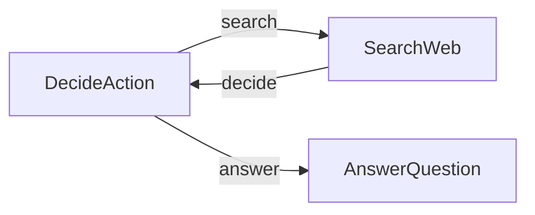

# PocoFlow Agent

A research agent that searches the web and uses YAML-structured LLM decisions.

## What It Shows

- **3-node agent loop**: decide -> search -> decide -> answer
- **YAML structured output**: LLM returns action decisions in YAML
- **Web search**: DuckDuckGo search integration
- **Retry**: DecideAction retries on YAML parse failures

## Run It

```bash
export ANTHROPIC_API_KEY="your-key"
pip install -r requirements.txt
python main.py
# or with a custom question:
python main.py --"What is quantum computing?"
```

## How It Works



- **DecideAction** — LLM decides whether to search or answer
- **SearchWeb** — searches DuckDuckGo, appends results to context
- **AnswerQuestion** — generates final answer from research

## Files

- `main.py` — flow wiring and entry point
- `nodes.py` — 3 node implementations
- `utils.py` — Anthropic Claude + DuckDuckGo wrappers
