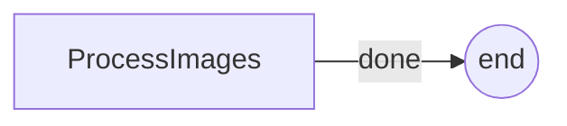

# PocoFlow Batch Flow

Image processing: applies multiple filters to multiple images.

## What It Shows

- **Batch-over-flows pattern**: processes all image-filter combinations
- **Single-node loop**: replaces PocketFlow's BatchFlow + self.params
- **PIL image processing**: grayscale, blur, sepia filters

## Setup

Place sample images in `images/` directory:
```
images/
  cat.jpg
  dog.jpg
  bird.jpg
```

## Run It

```bash
pip install -r requirements.txt
python main.py
```

## How It Works



The original PocketFlow example uses a BatchFlow that wraps a 3-node flow (LoadImage -> ApplyFilter -> SaveImage) and runs it for each image-filter combination via `self.params`. PocoFlow simplifies this to a single node that loops over all combinations.

## Files

- `main.py` — single-file implementation
