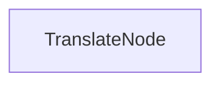

# PocoFlow Batch — Document Translation

Translates a markdown document into multiple languages using an LLM.

## What It Shows

- **Batch processing** pattern (loop inside exec)
- **Retry** for transient API errors
- **File I/O** in post phase
- **Multi-provider**: works with any supported LLM provider

## Run It

```bash
pip install -r requirements.txt

# Anthropic (default)
export ANTHROPIC_API_KEY="your-key"
python main.py --provider anthropic

# Ollama (local)
python main.py --provider ollama --model llama3.2

# See all options
python main.py --help
```

## How It Works



A single `TranslateNode` that processes a list of languages sequentially:
1. **prep** — builds `(text, language)` pairs
2. **exec** — translates each pair via LLM
3. **post** — writes each translation to a file
