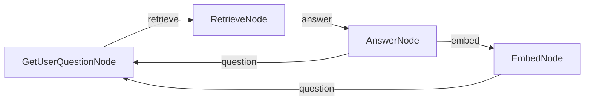

# PocoFlow Chat with Memory

A chat application with sliding-window memory and vector-based retrieval of past conversations.

## What It Shows

- **4-node flow**: question → retrieve → answer → embed
- **Sliding window**: keeps 3 most recent conversation pairs
- **Vector retrieval**: archives older conversations with embeddings, retrieves relevant context
- **FAISS**: efficient similarity search

## Run It

```bash
export ANTHROPIC_API_KEY="your-key"
export OPENAI_API_KEY="your-key"    # needed for embeddings
pip install -r requirements.txt
python main.py
```

## How It Works



- **GetUserQuestionNode** — reads user input
- **RetrieveNode** — searches FAISS index for relevant past conversations
- **AnswerNode** — calls Claude with recent + retrieved context
- **EmbedNode** — embeds and archives the oldest conversation pair

## Files

- `main.py` — flow wiring and entry point
- `nodes.py` — 4 node implementations
- `utils/call_llm.py` — Anthropic Claude wrapper
- `utils/get_embedding.py` — OpenAI embedding wrapper
- `utils/vector_store.py` — FAISS index helpers
