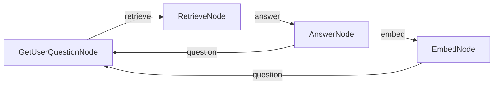

# PocoFlow Chat with Memory

A chat application with sliding-window memory and vector-based retrieval of past conversations.

## What It Shows

- **4-node flow**: question -> retrieve -> answer -> embed
- **Sliding window**: keeps 3 most recent conversation pairs
- **Vector retrieval**: archives older conversations with embeddings, retrieves relevant context
- **FAISS**: efficient similarity search
- **Multi-provider**: works with any supported LLM provider

## Run It

```bash
pip install -r requirements.txt

# Requires OpenAI for embeddings + any LLM provider for chat
export OPENAI_API_KEY="your-key"

# Anthropic (default)
export ANTHROPIC_API_KEY="your-key"
python main.py --provider anthropic

# Ollama (local, still needs OpenAI for embeddings)
python main.py --provider ollama --model llama3.2

# See all options
python main.py --help
```

## How It Works



- **GetUserQuestionNode** — reads user input
- **RetrieveNode** — searches FAISS index for relevant past conversations
- **AnswerNode** — calls LLM with recent + retrieved context
- **EmbedNode** — embeds and archives the oldest conversation pair

## Files

- `main.py` — flow wiring and CLI entry point
- `nodes.py` — 4 node implementations
- `utils/get_embedding.py` — OpenAI embedding wrapper
- `utils/vector_store.py` — FAISS index helpers
