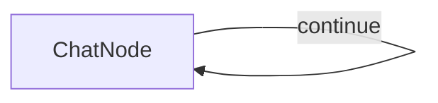

# PocoFlow Chat

A simple terminal chatbot built with PocoFlow and Anthropic Claude Sonnet 4.

## Run It

1. Set your API key:
    ```bash
    export ANTHROPIC_API_KEY="your-key"
    ```

2. Install dependencies and run:
    ```bash
    pip install -r requirements.txt
    python main.py
    ```

## How It Works



A single `ChatNode` with a self-loop:
- **prep** — reads user input, appends to message history
- **exec** — sends full conversation to Claude Sonnet 4
- **post** — prints reply, appends to history, loops back

Type `exit` to quit.

## Files

- `main.py` — ChatNode implementation and flow wiring
- `utils.py` — Anthropic API wrapper (`call_llm`)
- `requirements.txt` — dependencies
