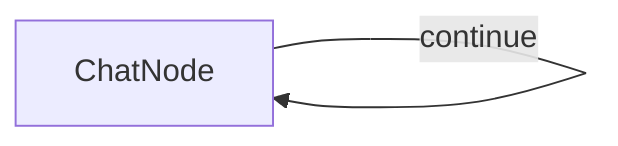

# PocoFlow Chat

A simple terminal chatbot built with PocoFlow.

## Run It

```bash
pip install -r requirements.txt

# Anthropic (default)
export ANTHROPIC_API_KEY="your-key"
python main.py --provider anthropic

# OpenAI
export OPENAI_API_KEY="your-key"
python main.py --provider openai

# Ollama (local, no API key needed)
python main.py --provider ollama --model llama3.2

# See all options
python main.py --help
```

## How It Works



A single `ChatNode` with a self-loop:
- **prep** — reads user input, appends to message history
- **exec** — sends full conversation to LLM
- **post** — prints reply, appends to history, loops back

Type `exit` to quit.

## Files

- `main.py` — ChatNode implementation and flow wiring
