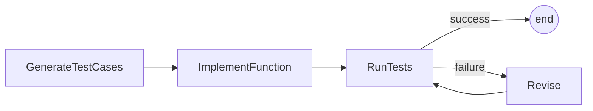

# PocoFlow Code Generator

Test-driven code generation: generates tests, implements, runs, and revises.

## What It Shows

- **4-node pipeline**: generate tests -> implement -> run tests -> revise (loop)
- **Revision loop**: up to 3 attempts to fix failing tests
- **Safe code execution**: runs generated code in subprocess with timeout
- **YAML structured output**: test cases in YAML format
- **Batch-in-exec pattern**: RunTests loops over test cases (replaces PocketFlow's BatchNode)
- **Multi-provider**: works with any supported LLM provider

## Run It

```bash
pip install -r requirements.txt

# Anthropic (default)
export ANTHROPIC_API_KEY="your-key"
python main.py

# With a custom requirement
python main.py --provider openai "Write a function called fibonacci that returns the nth fibonacci number"

# Ollama (local)
python main.py --provider ollama --model llama3.2

# See all options
python main.py --help
```

## How It Works



## Files

- `main.py` — flow wiring and CLI entry point
- `nodes.py` — 4 node implementations
- `utils.py` — safe Python code execution
