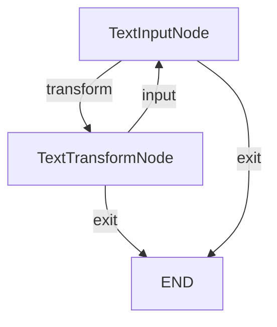

# PocoFlow Flow — Text Converter

An interactive text transformation tool demonstrating multi-node wiring and action routing.

## What It Shows

- **Multiple nodes** with `.then()` wiring
- **Action-based branching**: "transform" vs "exit"
- **Self-loop**: transform → input → transform
- **No LLM needed** — pure framework exercise

## Run It

```bash
pip install -r requirements.txt
python main.py
```

## How It Works


