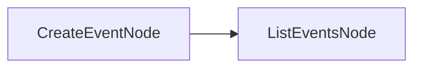

# PocoFlow Google Calendar

Manage Google Calendar events using PocoFlow.

## What It Shows

- **Google API integration**: OAuth2 authentication with Calendar API
- **Event management**: create events, list calendars, view upcoming events
- **Click CLI groups**: multiple subcommands in one tool

## Setup

1. Enable Google Calendar API in [Google Cloud Console](https://console.cloud.google.com/)
2. Download OAuth credentials as `credentials.json`
3. Install dependencies:

```bash
pip install -r requirements.txt
```

## Run It

```bash
# List your calendars
python main.py calendars

# Create an event
python main.py create "Team Meeting" --hours 2

# List upcoming events
python main.py events --days 14
```

## How It Works



- **ListCalendarsNode** — retrieves all user calendars
- **CreateEventNode** — creates a new calendar event
- **ListEventsNode** — lists upcoming events
