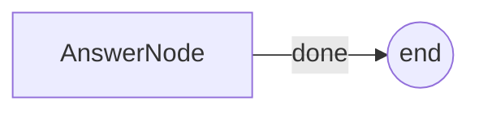

# PocoFlow Hello World

Minimal single-node example showing the prep/exec/post lifecycle.

## What It Shows

- **1 node**: AnswerNode calls the LLM to answer a question
- **Store**: holds question and answer
- **Flow**: single-node flow

## Run It

```bash
export ANTHROPIC_API_KEY="your-key"
pip install -r requirements.txt
python main.py
# or with a custom question:
python main.py "What is quantum computing?"
```

## How It Works



- **AnswerNode** — reads question from store, calls LLM, saves answer

## Files

- `main.py` — flow wiring and entry point
- `utils.py` — Anthropic Claude wrapper
