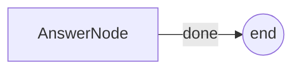

# PocoFlow Hello World

Minimal single-node example showing the prep/exec/post lifecycle.

## What It Shows

- **1 node**: AnswerNode calls the LLM to answer a question
- **Store**: holds question and answer
- **Flow**: single-node flow
- **Multi-provider**: works with any supported LLM provider

## Run It

```bash
pip install -r requirements.txt

# Anthropic (default)
export ANTHROPIC_API_KEY="your-key"
python main.py --provider anthropic "What is quantum computing?"

# OpenAI
export OPENAI_API_KEY="your-key"
python main.py --provider openai "What is quantum computing?"

# Ollama (local, no API key needed)
python main.py --provider ollama --model phi4 "What is 10!"

# openrouter
python3 main.py --provider openrouter --model google/gemini-2.5-flash "what is i*i ?"

# See all options
python main.py --help
```

## How It Works



- **AnswerNode** — reads question from store, calls LLM, saves answer

## Files

- `main.py` — flow wiring and CLI entry point
