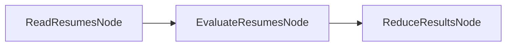

# PocoFlow Map-Reduce

Evaluate resumes using the map-reduce pattern with LLM-powered qualification assessment.

## What It Shows

- **Map-Reduce pattern**: read -> evaluate (batch) -> reduce
- **Batch-in-exec**: evaluates all resumes in a loop inside exec()
- **YAML structured output**: LLM returns evaluation in YAML format
- **Multi-provider**: works with any supported LLM provider

## Run It

```bash
pip install -r requirements.txt

# Anthropic (default)
export ANTHROPIC_API_KEY="your-key"
python main.py --provider anthropic

# Ollama (local)
python main.py --provider ollama --model llama3.2

# See all options
python main.py --help
```

## How It Works



- **ReadResumesNode** — reads all .txt files from data/ directory
- **EvaluateResumesNode** — sends each resume to LLM for qualification assessment
- **ReduceResultsNode** — aggregates results and prints summary
