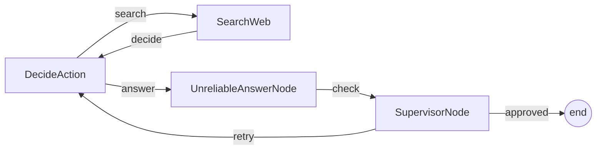

# PocoFlow Supervisor

A supervised research agent that validates answers and retries on bad output.

## What It Shows

- **4-node flow**: decide -> search/answer -> supervisor -> retry loop
- **Supervisor pattern**: validates LLM output before accepting
- **Unreliable node**: 50% chance of dummy answer (demonstrates need for supervision)
- **Flattened design**: original PocketFlow uses Flow-as-Node nesting; PocoFlow flattens to single flow
- **Multi-provider**: works with any supported LLM provider

## Run It

```bash
pip install -r requirements.txt

# Anthropic (default)
export ANTHROPIC_API_KEY="your-key"
python main.py "What is quantum computing?"

# Ollama (local)
python main.py --provider ollama --model llama3.2 "What is quantum computing?"

# See all options
python main.py --help
```

## How It Works



## Files

- `main.py` — flow wiring and CLI entry point
- `nodes.py` — 4 node implementations
- `utils.py` — DuckDuckGo search wrapper
