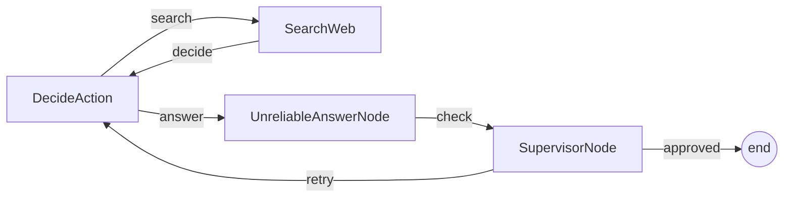

# PocoFlow Supervisor

A supervised research agent that validates answers and retries on bad output.

## What It Shows

- **4-node flow**: decide -> search/answer -> supervisor -> retry loop
- **Supervisor pattern**: validates LLM output before accepting
- **Unreliable node**: 50% chance of dummy answer (demonstrates need for supervision)
- **Flattened design**: original PocketFlow uses Flow-as-Node nesting; PocoFlow flattens to single flow

## Run It

```bash
export ANTHROPIC_API_KEY="your-key"
pip install -r requirements.txt
python main.py
# or with a custom question:
python main.py --"What is quantum computing?"
```

## How It Works



## Files

- `main.py` — flow wiring and entry point
- `nodes.py` — 4 node implementations
- `utils.py` — Anthropic Claude + DuckDuckGo wrappers
