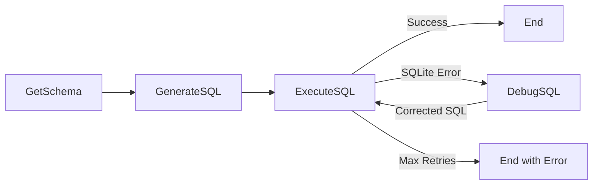

# PocoFlow Text-to-SQL

Convert natural language questions into executable SQL queries with an LLM-powered debugging loop.

## What It Shows

- **Schema awareness**: automatically retrieves database schema for LLM context
- **LLM SQL generation**: translates natural language to SQLite queries (YAML structured output)
- **Debug loop**: if SQL execution fails, the LLM attempts to fix the query (up to N retries)
- **Multi-provider**: works with any supported LLM provider

## Run It

```bash
pip install -r requirements.txt

# Anthropic (default)
export ANTHROPIC_API_KEY="your-key"
python main.py "total products per category"

# Ollama (local)
python main.py --provider ollama --model llama3.2 "list all customers from New York"

# See all options
python main.py --help
```

The sample `ecommerce.db` is created automatically on first run.

## How It Works



- **GetSchema** — reads SQLite table/column info
- **GenerateSQL** — LLM converts question + schema to SQL (YAML output)
- **ExecuteSQL** — runs the query; on error triggers debug loop
- **DebugSQL** — LLM fixes the failed SQL based on the error message
