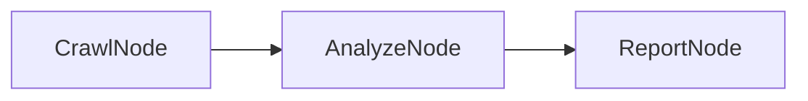

# PocoFlow Tool Crawler

Web crawler that analyzes website content using an LLM.

## What It Shows

- **Web crawling**: respects domain boundaries, configurable page limit
- **LLM analysis**: summarizes each page with topics and content type
- **YAML structured output**: LLM returns analysis in YAML format
- **Multi-provider**: works with any supported LLM provider

## Run It

```bash
pip install -r requirements.txt

# Anthropic (default)
export ANTHROPIC_API_KEY="your-key"
python main.py https://example.com --max-pages 3

# Ollama (local)
python main.py --provider ollama --model llama3.2 https://example.com

# See all options
python main.py --help
```

## How It Works



- **CrawlNode** — crawls the website extracting page content
- **AnalyzeNode** — sends each page to LLM for analysis (YAML output)
- **ReportNode** — aggregates analyses into a summary report
