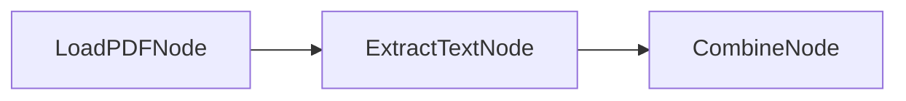

# PocoFlow Tool PDF Vision

Extract text from PDFs using GPT-4 Vision API (OCR).

## What It Shows

- **PDF processing**: converts PDF pages to images using PyMuPDF
- **Vision API**: sends page images to GPT-4o for text extraction
- **Multi-page**: processes all pages and combines results

## Run It

```bash
pip install -r requirements.txt
export OPENAI_API_KEY="your-key"
python main.py document.pdf
python main.py document.pdf --prompt "Extract tables from this page"
```

## How It Works



- **LoadPDFNode** — converts PDF pages to images
- **ExtractTextNode** — sends each page to GPT-4o Vision for OCR
- **CombineNode** — combines extracted text from all pages
