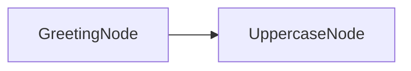

# PocoFlow Tracing

Workflow observability with Langfuse integration.

## What It Shows

- **Automatic tracing**: TracedNode base class instruments prep/exec/post
- **Langfuse integration**: sends traces and spans to Langfuse dashboard
- **Graceful degradation**: works without Langfuse installed (tracing disabled)

## Run It

```bash
pip install -r requirements.txt

# Optional: configure Langfuse
export LANGFUSE_PUBLIC_KEY="your-key"
export LANGFUSE_SECRET_KEY="your-secret"
export LANGFUSE_HOST="https://cloud.langfuse.com"

python main.py --name "Alice"
```

## How It Works



- **TracedNode** — base class that wraps `_run()` to create Langfuse spans
- **TracingContext** — manages Langfuse client, traces, and spans
