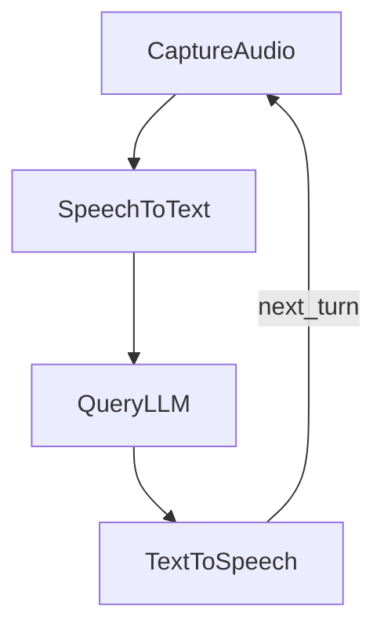

# PocoFlow Voice Chat

Continuous voice conversation with speech-to-text, LLM chat, and text-to-speech.

## What It Shows

- **Voice Activity Detection**: silence-based start/stop recording
- **Speech-to-Text**: OpenAI transcription API
- **LLM conversation**: maintains chat history across turns
- **Text-to-Speech**: OpenAI TTS with audio playback
- **Looping flow**: automatically listens for next query after responding

## Run It

```bash
pip install -r requirements.txt

# Linux may need PortAudio
sudo apt-get install -y portaudio19-dev

export OPENAI_API_KEY="your-key"
python main.py
```

## How It Works



- **CaptureAudioNode** — records from microphone with VAD
- **SpeechToTextNode** — converts audio to text via OpenAI
- **QueryLLMNode** — sends conversation to LLM
- **TextToSpeechNode** — converts response to speech, plays it, loops back
